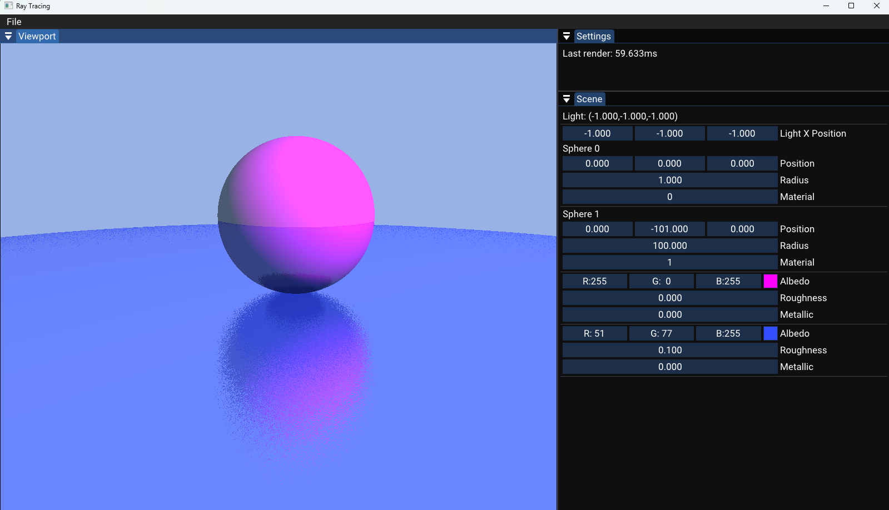

# Screenshots from Project

Screenshot showing reflective materials and physically based rendering

# Walnut App Template

This is a simple app template for [Walnut](https://github.com/TheCherno/Walnut) - unlike the example within the Walnut repository, this keeps Walnut as an external submodule and is much more sensible for actually building applications. See the [Walnut](https://github.com/TheCherno/Walnut) repository for more details.

## Disclamer
I'm developing this project based on Youtube Playlist "Ray Tracing" by The Cherno. 
If you want to learn more about ray tracing you can visit this playlist: https://youtube.com/playlist?list=PLlrATfBNZ98edc5GshdBtREv5asFW3yXl&si=cb-3jah8OKpPBF6y
